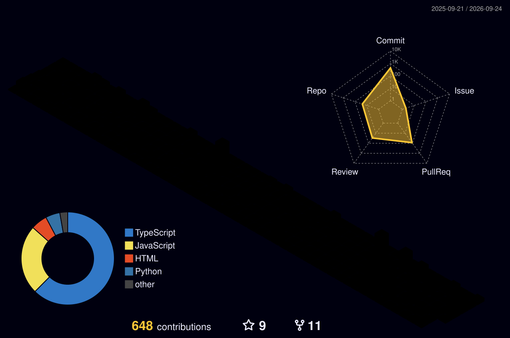

<div align="center">


[](https://linkedin.com/in/shouryadav)
[](mailto:shourya0523@gmail.com)
[](https://shouryadav.info)


</div>

<br>

### ~/ whoami

```bash
$ cat about.txt
```

- CS + Fintech @ Northeastern, class of 2025
- Data Engineering Intern @ Kroll → heading to M3 as a Healthcare Research Associate this fall
- Co-founded the Claude Builder Club at Northeastern — 200+ members, $30k+ in sponsorships
- Live in the overlap between data infra, finance, healthcare, and applied AI: NLP pipelines on patents and clinical trials, molecule databases, LLM-powered tooling

<br>

### ~/ toolbox


<br>

### ~/ contribution matrix — 3D

<div align="center">

</div>

<br>

### ~/ someone let a snake into the grid

<div align="center">

<picture>
  <source media="(prefers-color-scheme: dark)" srcset="https://raw.githubusercontent.com/shourya0523/shourya0523/output/github-contribution-grid-snake-dark.svg" />
  <source media="(prefers-color-scheme: light)" srcset="https://raw.githubusercontent.com/shourya0523/shourya0523/output/github-contribution-grid-snake.svg" />
  
</picture>

</div>

<br>

### ~/ the numbers

<div align="center">


<br><br>







</div>

<br>

<div align="center">

*currently building things I wished existed*

</div>
